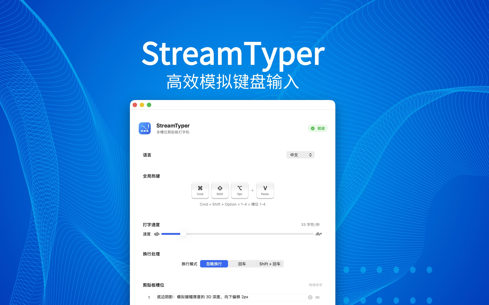

# StreamTyper

[English](README.md) | [中文](README_zh-CN.md)

**一款 macOS 工具，通过模拟键盘输入逐字打出剪贴板中的文本——绕过粘贴限制。**

<p align="center">
  
</p>

## 功能特性

- **模拟打字** — 通过键盘事件模拟逐字输入文本，绕过禁止 `Cmd+V` 粘贴的应用
- **速度控制** — 可调节打字速度，约 5 至 200 字符/秒
- **剪贴板槽位** — 4 个独立槽位，用于存储和管理常用文本片段，支持拖拽排序
- **换行模式** — 三种选项：忽略换行、发送回车、发送 Shift+回车（适用于聊天软件/富文本编辑器）
- **全局热键** — 无需切换窗口，在任何应用中触发打字：
  - `Cmd + Shift + Option + V` — 打出当前剪贴板内容
  - `Cmd + Shift + Option + 1–4` — 打出槽位 1–4 的内容
- **双语界面** — 支持英文和简体中文
- **随时中止** — 按 `Esc` 或点击鼠标即可立即停止打字

## 系统要求

- macOS 11.0 (Big Sur) 或更高版本
- Xcode 15+（从源码构建）
- 辅助功能权限（模拟按键所需）

## 安装

### 直接下载

从 [Releases](https://github.com/wanghaitao34/StreamTyper/releases/latest) 页面下载最新的 DMG 文件。打开 DMG，将 StreamTyper 拖入应用程序文件夹即可。

应用已通过 Apple 签名和公证，不会触发 Gatekeeper 安全警告。

### 从源码构建

```bash
git clone https://github.com/wanghaitao34/StreamTyper.git
cd StreamTyper
open StreamTyper.xcodeproj
```

在 Xcode 中构建并运行（`Cmd + R`）。

首次启动时，应用会提示你在 **系统设置 > 隐私与安全性 > 辅助功能** 中授予权限。

## 使用方法

1. 启动 StreamTyper，根据提示授予辅助功能权限。
2. 将文本复制到剪贴板，或在 4 个槽位中输入文本。
3. 切换到需要输入文本的目标应用。
4. 按下热键：
   - `Cmd + Shift + Option + V` 打出剪贴板内容
   - `Cmd + Shift + Option + 1` 到 `4` 打出对应槽位内容
5. StreamTyper 将逐字模拟键盘输入。
6. 随时按 `Esc` 或点击鼠标停止。

### 设置

- **打字速度** — 使用滑块调节字符输入速度。对于有输入延迟的应用，可能需要降低速度。
- **换行模式** — 选择如何处理文本中的换行符：
  - *忽略* — 跳过换行符
  - *回车* — 换行时发送 Return 按键
  - *Shift+回车* — 换行时发送 Shift+Return（适用于 Slack、Discord 等）

## 工作原理

StreamTyper 使用 macOS `CGEvent` API 将 Unicode 键盘事件直接发送到系统的 HID 事件层。每个字符以 key-down/key-up 事件对的形式发送，并附带 Unicode 字符串，完全绕过虚拟按键码映射。这使得它能够输入任何 Unicode 字符，不受当前键盘布局的限制。

全局热键通过 Carbon `RegisterEventHotKey` API 注册，实现系统级别的组合键捕获。

## 参与贡献

欢迎贡献代码！你可以：

- 提交 [Issue](https://github.com/wanghaitao34/StreamTyper/issues) 来反馈 Bug 或提出功能建议
- 提交 [Pull Request](https://github.com/wanghaitao34/StreamTyper/pulls) 来改进项目

## 许可证

Copyright 2025 青岛一本正经教育科技有限公司

基于 [Apache License, Version 2.0](LICENSE) 授权。详见 [LICENSE](LICENSE) 文件。
